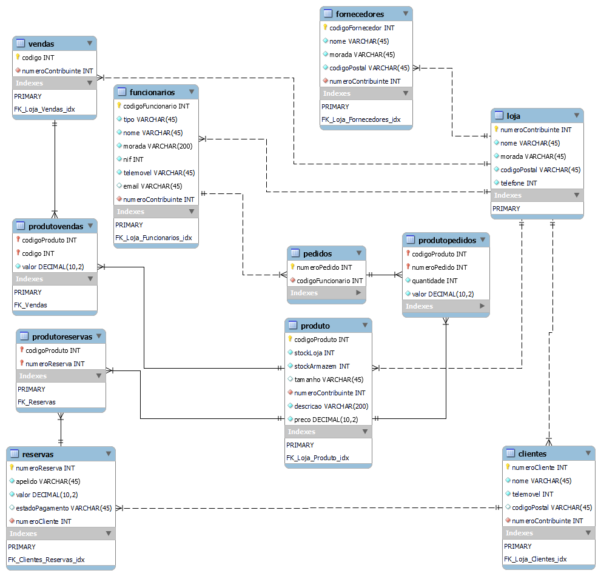

# C3 : Normalização

## Relações

VENDAS ( #numeroContribuinte -> LOJA , _ codigo _ )

FORNECEDORES ( #numeroContribuinte -> LOJA , _ codigoFornecedor _ , nome, morada , codigoPostal )

CLIENTES ( #numeroContribuinte -> LOJA, _ numeroCliente _ , nome , telemovel , codigoPostal )

PRODUTO ( #numeroContribuinte -> LOJA , _ codigoProduto _ , stockLoja , stockArmazem , tamanho , preco , descricao )

RESERVAS ( #numeroCliente -> CLIENTES , _ numeroReserva _ , apelido , valor , estadoPagamento )

PEDIDOS ( #codigoFuncionario -> FUNCIONARIOS , _ numeroPedido _ )

FUNCIONARIOS ( #numeroContribuinte -> LOJA , _ codigoFuncionario _ , tipo , nome , morada , NIF , telemovel , email )

saoElaboradas ( #numeroReserva -> RESERVA , #_ codigoProduto _ -> PRODUTO )

feitos ( #numeroPedido -> PEDIDO , #_ codigoProduto _ -> PRODUTO )

## Normalização do Esquema Relacional

DF

codigoFornecedor -> nome, morada, codigoPostal 
numeroCliente -> nome, telemovel, codigoPostal
codigoProduto -> stockLoja , stockArmazem , tamanho , preco , descricao
numeroReserva -> apelido , valor , estadoPagamento
codigoFuncionario -> tipo , nome , morada , NIF , telemovel , email

1NF 

LojaRoupa ( _ numeroContribuinte _, nome , morada , codigoPostal , telefone , _numeroCliente _ , nome , telemovel , codigoPostal , _ codigoFuncionario _ , tipo , nome , morada , NIF , telemovel , email )

2NF

LojaRoupa ( _ numeroContribuinte _ , _numeroCliente _ , nome , telemovel , codigoPostal , _ codigoFuncionario _ , tipo , nome , morada , NIF , telemovel , email )

EnderecoLoja (#_ numeroContribuinte _ -> LojaRoupa , _ morada _ , codigoPostal , telefone)

3NF

Loja Roupa ( _ numeroContribuinte _ , _numeroCliente _ , _ codigoFuncionario _ , tipo , nome , morada , NIF , telemovel , email )

FichaCliente (#_ numeroCliente _ -> LojaRoupa , nome , telemovel , codigoPostal )

4NF

Loja Roupa ( _ numeroContribuinte _ , _numeroCliente _ , _ codigoFuncionario _ )

DadosFuncionario (#_ codigoFuncionario _ -> LojaRoupa , tipo ,  nome , morada , NIF , telemovel , email )

FichaCliente (#_ numeroCliente _ -> LojaRoupa , nome , telemovel , codigoPostal )

EnderecoLoja (#_ numeroContribuinte _ -> LojaRoupa , _ morada _ , codigoPostal , telefone)

Vendas já está na quarta forma normal.

Pedidos já está na quarta forma normal.

---
[< Previous](rebd02.md) | [^ Main](https://github.com/leonorVicente/tcm21-sibd-g10/) | [Next >](rebd04.md)
:--- | :---: | ---: 
